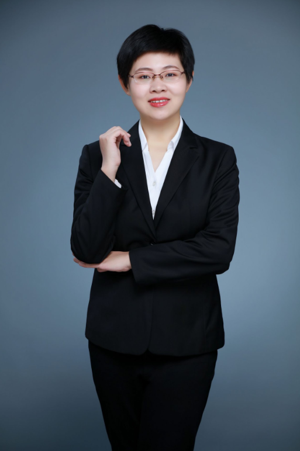

<!-- CSS -->

<button onclick="toggleLanguage()">Language</button>

<!-- 英文内容 -->

<!-- 分栏界面开始 -->

  <a href="publications.html" class="column" target="_blank">Publications</a>
  <a href="members.html" class="column" target="_blank">Members</a>
  <a href="teaching.html" class="column" target="_blank">Teaching</a>
  <a href="resources.html" class="column" target="_blank">Resources</a>
  <a href="joinus.html" class="column" target="_blank">Join Us</a>

<!-- 分栏界面结束 -->
<!-- README.md -->
<h1>Jing Liu's Homepage</h1>

Hi, I am now an Associate Professor with Multimedi Institute of Tianjin University. I received the B.E and Ph.D. degree from Shanghai Jiao Tong Univeristy under the supervision of Prof. <a href="https://english.seiee.sjtu.edu.cn/english/detail/842_802.htm">Xiaokang Yang</a> and Prof. <a href="https://scholar.google.ca/citations?user=E6zbSYgAAAAJ">Guangtao Zhai</a>. I am also supervised by Prof. <a href="https://cse.buffalo.edu/UBMM/People/dr.chen.html">Chang Wen Chen</a> when visiting at SUNY@Buffalo from 2014-2015. My research interest includes: image/video processing and cross-modal video content analysis.  
  <ul>
    <li>Email:  jliu_tju@tju.edu.cn</li>
    <li>Address: Tianjin University,26D Building, Rm 413</li>
    <li>Github: <a href="https://github.com/TJUMMG" target="_blank">TJUMMG</a></li>
  </ul>

<h2>Work Experience</h2>
  <ul>
    <li>2019-now: Associate Professor, Tianjin University, China </li>
    <li>2017-2019 : Assistant Professor, Tianjin University, China</li>
    <li>2017-2019 : Post-doc, Tianjin University, China</li>
  </ul>

<h2>Educational Experience</h2>
  <ul>
    <li>2011-2017: PhD, Shanghai Jiao Tong University, China</li>
    <li>2014-2015: Visiting Scholar, State University of New York, U.S.</li>
    <li>2007-2011: Bachelor, Shanghai Jiao Tong University, China</li>
  </ul>

<h2>Research Interest</h2>
  <ul>
    <li>Image/Video Processing (Enhancement, Quality Assessment,  etc.)</li>
    <li>Video Content Analysis (Segmentation, Tracking, Cross-modal Retrieval, etc.)</li>
    <li>Recommendation Systems (Cross-domain Recommender, Interactive Recommender)</li>
  </ul>

<h2>Openings</h2>
  <ul>
    <li>Looking for self-motivated graduate students working with me. For prospective students, please send your resume and transcript to my email.</li>
    <li>The research group is inviting students to enter the Master program in Autumn 2024. Please contact us by email.</li>
  </ul>

<h2>NEWS!</h2>
  <ul>
    <li>09/2023, I am promoted to advanced membership of CCF.</li>
    <li>09/2023, our work SiamDMU is accepted by IEEE TETCI  with code available at GitHub.</li>
    <li>09/2023, we have successfully host the 3rd CSIG Excellent Doctoral Forum in Tianjin Univeristy!</li>
    <li>8/2023, our proposal is granted by National Science and Foundation of China.</li>
    <li>07/2023, one work is accepted by ACM MM with code coming song.</li>
    <li>07/2023, our work MSTFN is accepted by IEEE TMM with code available at GitHub.</li>
    <li>04/2023, our work KCLR is accepted by IEEE TMM.</li>
    <li>04/2023, our work MALN is accepted by IEEE TCSVT.</li>
    <li>03/2023, our work MRFT is accepted by IEEE TCSVT.</li>
    <li>01/2023, our work SAW is accepted by IEEE TIP with code available at GitHub.</li>
    <li>12/2022, our work TGSR is accepted by IEEETCSVT with code available at GitHub.</li>
    <li>12/2022, our work BE-DS won the Best Poster Award of IFTC2022.</li>
    <li>08/2022, I am enrolled in the MM Committee of CSIG and CCF.</li>
    <li>--/2022, our work QA-PRI won the 2021 Prize Paper Award Runner-up of IEEE TMM.</li>
    <li>09/2021, our work TANET is accepted by IEEE TMM with code available at GitHub.</li>
    <li>06/2021, our work RMFNet is accepted by IEEE TCSVT.</li>
    <li>12/2020, I am enrolled  in Editoral Board of Displays (Springer)</li>
    <li>06/2020, our work LRML is published in IEEE TMM.</li>
    <li>12/2019, I am enrolled in Beiyang Scholar Program-Young Teacher.</li>
    <li>10/2019, our work BE-CALF is published in IEEE TIP with code available at GitHub.</li>
    <li>10/2019, two of my students Wanning Sun and Pingping Liu was granted National Scholarship.</li>
    <li>09/2019, our work SSCNN is published in IEEE TMM.</li>
    <li>11/2018, I receive an honer for CSIG candidate excellent doctoral dissertation.</li>
    <li>10/2018, our work IPAD is published in IEEE TIP with code available at GitHub.</li>
  </ul>

<!-- 中文内容 -->

<!-- 分栏界面开始 -->

  <a href="publications.html" class="column" target="_blank">出版物</a>
  <a href="members.html" class="column" target="_blank">成员</a>
  <a href="teaching.html" class="column" target="_blank">教学</a>
  <a href="resources.html" class="column" target="_blank">资源</a>
  <a href="joinus.html" class="column" target="_blank">加入我们</a>

<!-- 分栏界面结束 -->
<!-- README.md -->
<h1>刘婧的主页</h1>

大家好，我现在是天津大学电气自动化与信息工程学院的副教授。毕业于上海交通大学，师从<a href="https://english.seiee.sjtu.edu.cn/english/detail/842_802.htm">杨小康</a>教授和<a href="https://scholar.google.ca/citations?user=E6zbSYgAAAAJ">翟广涛</a>教授，获得了学士学位和博士学位。2014-2015年访问SUNY@Buffalo期间，我的导师是<a href="https://cse.buffalo.edu/UBMM/People/dr.chen.html">陈长汶</a> 教授。我的研究兴趣包括:图像/视频处理和跨模态视频内容分析。  
  <ul>
    <li>邮箱:  jliu_tju@tju.edu.cn</li>
    <li>地址: 天津大学卫津路校区26教D区413</li>
    <li>实验室Github: <a href="https://github.com/TJUMMG" target="_blank">TJUMMG</a></li>
  </ul>

<h2>工作经历</h2>
  <ul>
    <li>2019-至今: 副教授, 天津大学 </li>
    <li>2017-2019 : 助理教授, 天津大学</li>
    <li>2017-2019 : 博士后, 天津大学</li>
  </ul>

<h2>教育经历</h2>
  <ul>
    <li>2011-2017: 博士, 上海交通大学</li>
    <li>2014-2015: 访问学者, 美国纽约州立大学</li>
    <li>2007-2011: 本科, 上海交通大学</li>
  </ul>

<h2>研究兴趣</h2>
  <ul>
    <li>图像/视频处理（增强、质量评估等）</li>
    <li>视频内容分析（分割、跟踪、跨模态检索等）</li>
    <li>推荐系统（跨域推荐器、交互式推荐器）</li>
  </ul>

<h2>招生</h2>
  <ul>
    <li>寻找有上进心的研究生和我一起工作。对于未来的学生，请将你的简历和成绩单发送到我的电子邮件中。</li>
    <li>课题组招收2024年秋季入学硕士，欢迎保研/考研同学邮件联系。</li>
  </ul>

<h2>消息！</h2>
  <ul>
    <li>2023年9月，我晋升为CCF高级会员。</li>
    <li>2023年9月，我们的工作SiamDMU被IEEE TETCI接收，代码可在GitHub上获得。</li>
    <li>09/2023，我们在天津大学成功举办了第三届CSIG优秀博士论坛！</li>
    <li>2023年8月，我们的提案获得国家科学基金资助。</li>
    <li>07/2023, 我们的工作已经被ACM MM接收。</li>
    <li>2023年7月，我们的工作MSTFN被IEEE TMM接收，代码可在GitHub上获得。</li>
    <li>2023年4月，我们的工作KCLR被IEEE TMM接收。</li>
    <li>2023年4月，我们的工作MALN被IEEE TCSVT接收。</li>
    <li>2023年3月，我们的工作MRFT被IEEE TCSVT接收。</li>
    <li>2023年1月，我们的工作SAW被IEEE TIP接收，代码可在GitHub上获得。</li>
    <li>2022年12月，我们的工作TGSR被IEEETCSVT接收，代码可在GitHub上获得。</li>
    <li>2022年12月，我们的工作BE-DS获得IFTC2022最佳海报奖。</li>
    <li>2022年8月，我加入了CSIG和CCF的MM委员会。</li>
    <li>2022年，我们的工作QA-PRI获得了IEEE TMM 2021年度论文奖亚军。</li>
    <li>2021年9月，我们的工作TANET被IEEE TMM接受，代码可在GitHub上获得。</li>
    <li>2021年6月，我们的工作RMFNet被IEEE TCSVT接收。</li>
    <li>2020年12月，我加入了编辑展示委员会(Springer)</li>
    <li>2020年6月，我们的工作LRML发表在IEEE TMM上。</li>
    <li>2019年12月，就读于北洋学者计划-青年教师。</li>
    <li>2019年10月，我们的工作BE-CALF发表在IEEE TIP上，代码可在GitHub上获得。</li>
    <li>2019年10月，我的两名学生Wanning Sun和Pingping Liu获得国家奖学金。</li>
    <li>2019年9月，我们的工作SSCNN发表在IEEE TMM上。</li>
    <li>2018年11月，我收到了一篇CSIG优秀博士论文。</li>
    <li>2018年10月，我们的工作IPAD发表在IEEE TIP上，代码可在GitHub上获得。</li>
  </ul>

